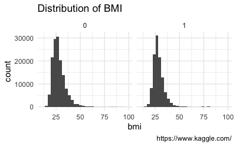
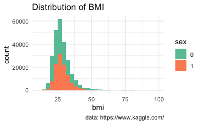
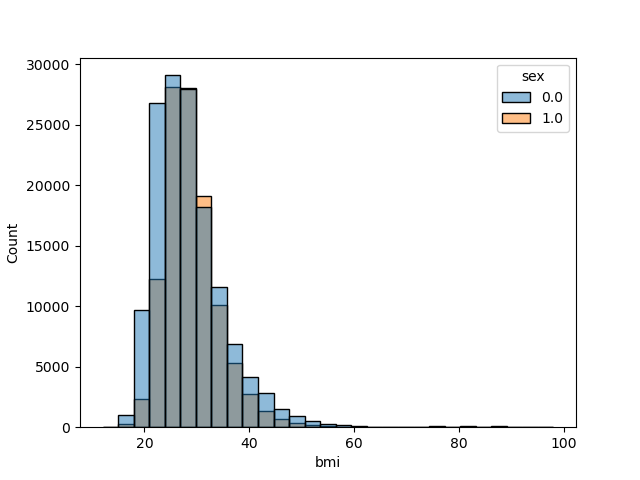
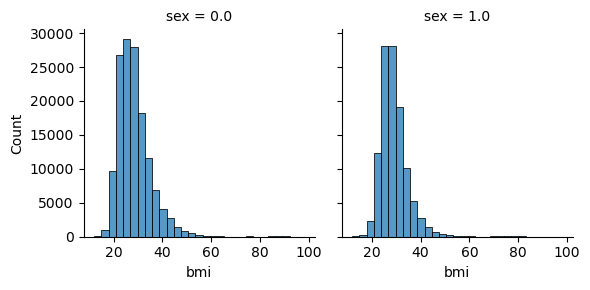

# 2024-ABDSA-notes

2024-12-11, denis schluppeck

A couple of pointers, links to resources and ideas that came up

## Media stuff

## Tabular data

I downloaded a sample health-related data set from
[this kaggle page](https://www.kaggle.com/datasets/alexteboul/diabetes-health-indicators-dataset) on diabetes. It's real data - checkout details on the kaggle website.

The `tidy_data_demo` folder has the files and some sample code to show how to create plots in `r`

### A very simple version (`R`)

... maybe a better version

### A very simple version (`python`)

Using pandas, seaborn, and friends.

... maybe a better version (using facets).

## Making documents

- markdown is everywhere. Especially also on `github`!
- an `ipynb` notebook converted to [html format](./test_quarto.html)
- ... or as [PDF notes?!](./test_quarto.pdf)

## back to repo

[link to github repo](https://github.com/schluppeck/2024-ABDSA-notes)
